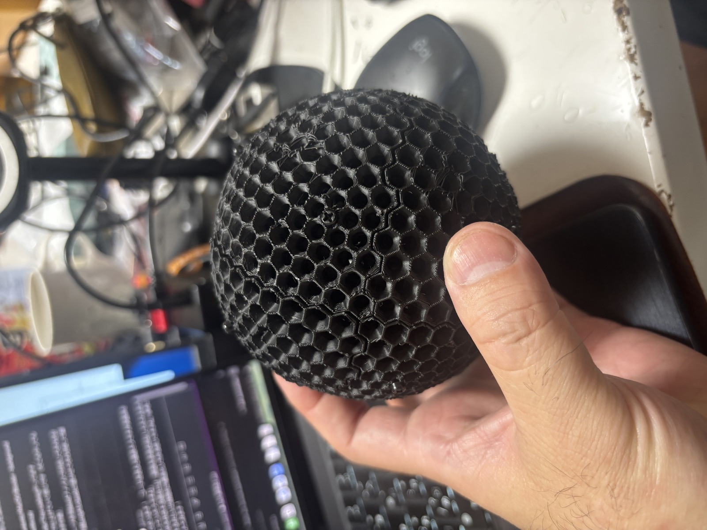
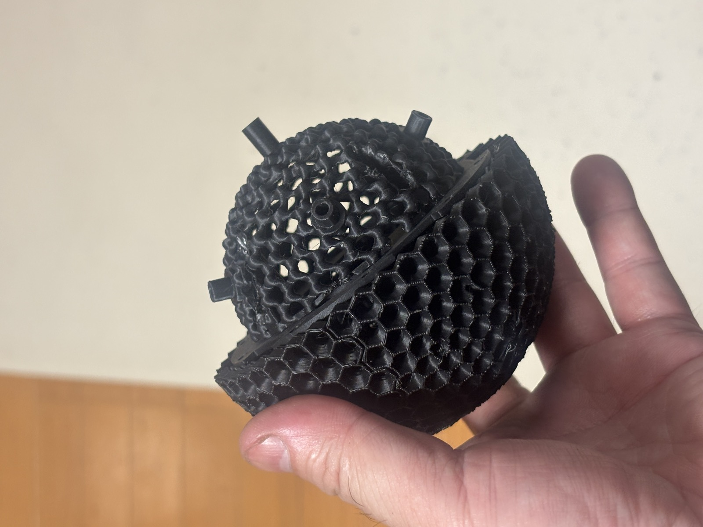
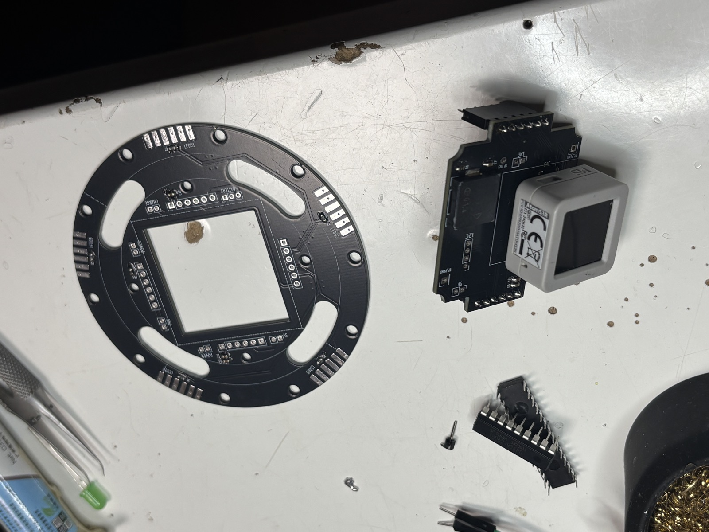

> **コンタクトジャグリングで使うクリスタルボール**——手のひらや腕の上をなめらかに転がる、あの透明な球。あれを**自分で光らせて、映像まで映せるガジェットにしたい**。それがこのプロジェクトの出発点です。
>
> 作っているガジェットの名前は **「Isolation Sphere」**。技術的に言えば、直径100mmの球面に800個のフルカラーLEDを敷きつめた球体ディスプレイ（いわばデジタル地球儀のようなもの）。でも目的はディスプレイ作りそのものではなく、**「光るジャグリング・プロップ」**が欲しかった。ここがすべての設計判断の起点になります。
>
> 名前の **「Isolation（アイソレーション）」** は、実はコンタクトジャグリングの技の名前。**手のひらの上で、ボールが空中に固定されているように見せる"錯覚（イリュージョン）"** の技です（参考：[アイソレーションと呼ばれるイリュージョン｜丸いブログ](https://blog.latelier-maru.com/isolation_illusion/)）。本機は IMU で映像を空中に静止させます——いわばその"アイソレーション"を映像でも再現する球。名前はここに由来します。
>
> 何世代も作り直してきたこのデバイスの、**現時点での到達点＝決定版**の設計を、これから何本かに分けて記録していきます。この記事はその**序章**。
>
> ※ この記事は連載のハブです。各回の技術詳細（多面体の作り方、FPC展開図、ファームウェア…）は個別記事に分け、ここから辿れるようにしています。

<!-- 画像: blog/images/avocado/web/IMG_8171.jpg（noteはアップロード／Zennは/images/へ） -->

*▲ 試作中の外殻。黒PETGのハニカム（ラッパ穴）を組んだ「握れる球」。これを光らせるのがゴール。*

## 1. 何を作るのか —— 「光るジャグリングボール」

そもそもコンタクトジャグリングとは、透明な球を手や腕の上でなめらかに転がして操る芸です。たとえばこんな感じ（例）：

https://www.youtube.com/watch?v=xvz0xIYcYGo

*▲ コンタクトジャグリングの例（JCJC4th. Free Performance Okotanpe ／ Yu Yoneya さんのチャンネルより）。この「手で操る球」を光らせたい、というのが出発点。*

ゴールは**コンタクトジャグリングのプロップを光らせること**。だから、ふつうの「LEDディスプレイ」とは制約が違います。

- **手のひらで転がせる、なめらかな球面**であること（突起やケーブルは論外）
- **落としても・転がしても壊れない**こと（ジャグリングは必ず落とす）
- **ケーブルレスで自己完結**（バッテリ内蔵・ワイヤレス）
- 手に収まるサイズ＝**直径100mm**

その上で、最終形のスペックはこうなりました。

- 直径**100mm**の球体に、**800個**のフルカラーLED（WS2812系）を球面いっぱいに
- スマホ/PCから映像を流し込み、リアルタイムに球面ディスプレイとして光る
- 内蔵IMUで姿勢を検知し、**球を手で転がしても、映像は空中で静止して見える**（姿勢補正で world-lock）
- スマホUI / 物理ジョイスティックで操作

そして、この決定版を貫く設計の核心を一行で言うと——

> **接着剤ゼロ・カセット交換式・骨組みFPCベース。**

「落とす前提のプロップ」という出発点から、この3語がまっすぐ導かれます。それを語るには、ここに至るまでの話をしないといけません。

## 2. ここに至るまで（前提）

この球体は、いきなりこの形で生まれたわけではありません。LED表示デバイスを何年も作り続けてきた、その系譜の先にあります。

- **POV / 「neon」世代** — 残像（Persistence of Vision）で空中に絵を描く球体ディスプレイ。**基板をマイクロドローンのモーターで高速回転**させ、2mm角LED45個で音楽と同期して描画する“光るボール”。Maker Faire Tokyo 2019で直径約8cm・45×120解像度を展示し、[Make: Japan にも掲載](https://makezine.jp/blog/2019/08/mft2019_report_04-2.html)された（制作記録は[はてなブログ](https://tajmahal0707.hatenablog.com/)）
- **Isolation Cube 世代（センサ連動）** — 市販LED基板の**立方体**で試作し、**IMUで「表示している絵が空中に固定されて見える」**を実現（まさに"アイソレーション"）。LED配置・大量駆動・姿勢補正のノウハウが固まった。製品名の「Isolation」は、このキューブ時代から続いている（[Elchika記事](https://elchika.com/article/9b97a7b7-561f-4795-9e16-3e011c045913/) / [発表スライド](https://www.slideshare.net/slideshow/5pptx/262723452)）

https://youtu.be/w3pRgsE_wJo

*▲ Isolation Cube（自身のチャンネル yakatano / Tajmahal「isolation cube : texture variations」）。表示が空中に固定されて見える＝アイソレーション。*

neon（POV世代）の実際の動きがこちら：

https://youtu.be/RsF1bUGjQ_o

*▲ 残像で絵を描く neon（自身のチャンネル yakatano / Tajmahal）。中で基板が高速回転している＝つまり手では握れない。*

そして、neonの初期からずっと抱えていた**悲願**がありました——

> **シェルの中に全部を収めて、手で握れる「ボール」にする。**

neonは中で**モーターが基板を回し続けて**残像を描く方式。つまり構造上、手に持って転がすことはできません。「回転する透明な球を手で操るコンタクトジャグリング、あれを光らせたらエモくないか？」——その問いに本気で答えるには、**回転をやめ、800個のLEDを殻に固定し、軸も配線も電源も全部を球の中に閉じ込める**必要があった。これまでに培った技術（球面LED配置・大量駆動・姿勢補正）はそのまま踏襲しつつ、最後のピース「握れるボールにする」を解くのが本シリーズ＝決定版です。

（過去世代の詳細は上記リンク先に譲ります。ここでは「ここに至る道」として触れるだけにします。）

## 3. 転換点 —— 「全損トラウマ」が決定版を生んだ

旧世代の球体には、見た目では分からない致命的な弱点がありました。

**接着剤で全部固めて作っていた**のです。LEDをスパイラル状に配線し、球面に貼り付けて固定する。完成したときは美しい。けれど——

> データチェーンの途中のLEDが1個でも死ぬと、そこから先が全部消灯する。
> しかも接着剤で固めてあるので**分解できず、直せない**。球体まるごと作り直し。

https://www.youtube.com/watch?v=QNamyMWMD3c

*▲ 接着剤でLEDを貼り付けた"トラウマ"世代（自身のチャンネル「白外壁にLED貼り付け」）。この方式は1個壊れると全損した。*

この「**全損**」を何度か味わって、設計の発想そのものを変えることにしました。しかも用途はコンタクトジャグリング——**プロップは毎回落とす**。壊れないこと・直せることは「あれば嬉しい」ではなく、**最初から必須要件**だったのです。

そこで方針を反転させました。**壊れることを前提に、壊れた所だけ交換できる**球体を作る。ここから決定版の3原則が一直線に導かれます。

| 反省（旧世代の限界） | 決定版の原則 |
| --- | --- |
| 1個壊れると全損 | **カセット交換式**（10分割、壊れた区画だけ抜く） |
| 接着剤で分解不能 | **接着剤ゼロ**（機械的な勘合とネジだけで保持） |
| スパイラル配線で硬い・直せない | **骨組みFPCベース**（柔軟基板で球面に追従） |

このシリーズの各記事は、結局すべて「この3原則をどう物理的に成立させたか」の話です。**トラウマが設計を決めた**——この一本の筋が、全体を貫いています。

## 4. システム全体像

この球体は、大きく**ハード3領域**と**ソフト3領域**でできています。

### ハードウェア：外から内への断面

球の表面から中心に向かって、こう積層しています。

```text
   外殻シェル（黒PETG・ラッパ穴）   ← 3Dプリント、10カセットに分割
        │  LEDがラッパ穴の奥に座る
   骨組みFPC（表:800 LED / 裏:0603）  ← 柔軟基板、球面に追従
        │  back_goreで機械的に押さえる（接着剤ゼロ）
   赤道：ポゴピン → マザーリング     ← カセット同士の電気接続
        │
   球体コア（LiPo×2 + ESP32 + 充電IC）  ← 全部この中に封入
```

「軸も配線も電源も球の中に閉じ込める」という悲願が、この入れ子構造になりました。

<!-- 画像: blog/images/avocado/web/IMG_8168.jpg -->

*▲ 実物の「アボガドコア」。外殻＋内殻ドームの二重殻を、中間平面で黒いマザーリングが塞ぐ（果肉＋種＝アボカド）。突き出ているのは pillar（極スタブ）。*

### ソフトウェア：映像はどう球面に届くか

```text
  スマホ / PC（WebUI）
        │  操作（MQTT） / UI同期（WebSocket）
        ▼
  サーバー（Ubuntu / RasPi）
   FastAPI + React + MQTT + 映像生成
        │  制御=MQTT   映像=UDP
        ▼
  ESP32-S3（M5Atom S3R）
        │  5並列出力
        ▼
  800個のLED  ←─ IMU(BNO055)で姿勢補正（映像は空中で静止）
```

**制御はMQTT・映像はUDP**と通信路を分け、ESP32は5本のストリップへ並列に流し込みます。球をどう転がしても、IMUが姿勢を読んで映像を世界に固定し続けます。

（各領域の中身は、本編Book／小話で詳しく。)

## 5. 主要スペック早見表

| 項目 | 仕様 |
| --- | --- |
| サイズ | 外径 **φ100mm** / 内径 φ90mm（殻厚5mm） |
| LED | **WS2812系 2020（2×2mm）×800個** |
| 多面体 | ゴールドバーグ G(9,0)・**T=81**（六角形800＝LED / 五角形12＝LED無し） |
| カセット | **10分割**（経度5 × 南北2、各80 LED）。1枚ずつ交換可 |
| データ | **5ストリップ × 160 LED**（北80→赤道クロス→南80）、ESP32が5並列駆動 |
| マイコン | **ESP32-S3（M5Atom S3R）**、8MB Flash / 8MB PSRAM |
| 姿勢センサ | **IMU BNO055**（映像を空中に固定） |
| 電源 | **LiPo 2000mAh × 2**（球体コア内）、南極マグネット端子で充電 |
| 通信 | 制御=MQTT / 映像=UDP / UI同期=WebSocket |
| 固定方式 | **接着剤ゼロ** —— back_gore機械挟持 + M2.5クランプねじ×10 |
| 外装 | 黒PETG（3Dプリント）、LEDごとにラッパ穴（視野角~120°） |

<!-- 画像: blog/images/avocado/web/IMG_8188.jpg -->

*▲ マザーリング（中央の角穴＝球体コア用の開口、周囲に給電・データの金パッド）と頭脳の ESP32（M5 AtomS3R）。*

> 設計フェーズの数値です。試作検証で詰める項目（赤道圧着力、磁気端子の型番など）は各記事末に正直に残します。

## 6. 目次 —— 各論はここから

> この記事（note）は**物語のポータル**です。具体的な設計とコードは **Zenn** にまとめています。気になるところから読んでください。

**本編（Zenn Book「Isolation Sphere V2 決定版」）— 通して読む**

1. シェル設計: ゴールドバーグ多面体を3Dプリントする
2. 骨組みFPC: 800個のLEDを1種のGerberで配線する
3. 接着剤ゼロの組立機構: ポゴピンとカセット交換
4. 電源と充電: 南極磁気端子とLiPo
5. ファームウェア: ESP32-S3で800 LED + IMU姿勢補正
6. 制御サーバーとWebUI: 映像配信と操作系

**小話（Zenn 単発）— 気になるトピックだけつまむ**

- [ゴールドバーグ多面体を numpy で生成する](https://zenn.dev/sastle/articles/4156ddb961e4da)
- [Boolean なしで球殻を watertight に分割する](https://zenn.dev/sastle/articles/d5dfab18aa2500)
- 外殻は白か黒か？（準備中）
- FPC展開図の作り方（MDS平面化）
- MAX16054 マグネット給電スイッチ兼用
- AIと対話しながらハードを設計する

（各リンクは公開時に Zenn の実URLへ差し込む）

## 7. このシリーズに通底する3つの考え方

各記事はバラバラの技術ネタに見えて、実は同じ価値観でつながっています。読むときの補助線として。

1. **壊れる前提で作る** —— コンタクトジャグリングのプロップは必ず落ちる。だから「直せること」が最初の要件。接着剤ゼロ・カセット交換式は、この一点から生まれた。
2. **幾何学が、製造コストと単純さに直結する** —— 球の5回対称をうまく使うと、FPCは「1種類のGerberを10枚」で済む。きれいな対称性は、そのまま安さと作りやすさになる。
3. **デッドスペースに役割を与える** —— 多面体に必ずできてしまう12個の五角形（LEDを置けない）を、クランプねじの穴や極のキャップに転用する。「無駄」を設計の道具に変える。

---

> ここまで読んでくれてありがとうございます。各論（多面体の作り方、FPC展開図、ファームウェア…）は **Zenn** に書いています。§6の目次から、気になるところへどうぞ。
>
> ——「握れて、落としても直せる、光るボール」を作る話の、これが入口です。
