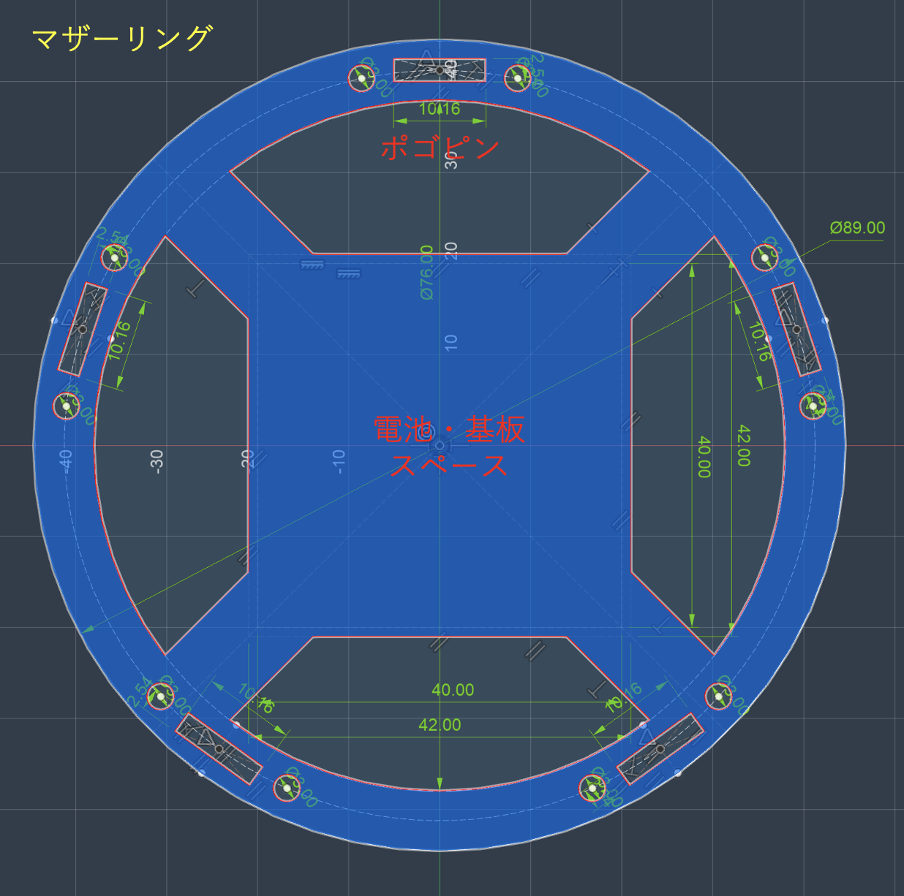

# Shell CAD — 球体外殻 Blender モデリング

<subproject>
- name: shell-cad
- parent: Isolation Sphere V2
- status: wip
- owner: sastle-com
- depends_on: []
</subproject>

## Scope / この doc が扱う範囲

- T=81 ゴールドバーグ多面体 G(9, 0) の生成スクリプト ([`../shell-cad/scripts/goldberg.py`](../shell-cad/scripts/goldberg.py))
- 外殻 (φ100mm / 殻厚 5mm) のメッシュ化と 10 カセット分割
- 各 LED 位置への円錐窓 (ラッパ穴, ~120°) の Boolean 抜き
- 裏面の構造物 (FPC 位置決めピン/アンカーポスト / `inner_deck` ポゴ台座 / `ring_claw` / `back_gore` / 南極ネジボス) の追加 — 詳細は [§カセット裏面構造](#cassette-back-side-structures--カセット裏面構造-inner_deck--back_gore--ring_claw)
- 各カセット用 STL 出力 × 10
- **LED 座標の producer** として `shared/led_positions.csv` を出力 (consumer は fpc-kicad)

## Out of scope / 扱わない範囲

- FPC の KiCad アートワーク → [`02-fpc-kicad.md`](02-fpc-kicad.md)
- ESP32 ファーム → 今回スコープ外 (CLAUDE.md §1, §3 Q2)

## Confirmed decisions / 確定事項

- **多面体**: クラス I Goldberg `G(9, 0)`, T = 81 → 812 面 (12 五角形 + 800 六角形), 1620 頂点, 2430 辺
- **向き**: 5 回対称軸を Z 軸に固定 (北極/南極に五角形 1 個ずつ + 5 longitudinal カセット分割と整合)
- **赤道**: m=9 (奇数) のため **どの面中央も Z=0 上に来ない** (最小 |z| ≈ 2.91 mm = 半径の 5.8%) ✓
  - 90 個の六角形は Z=0 をまたぐが、§4.1 の「赤道フラットカット → 切断面を平面クリーンアップ」で吸収する想定
- **生成手法**: 純 Python (`numpy` のみ) で頂点/面リストを構築 → OBJ 出力 → Blender 手動 import
  - bpy 依存にしないことで CI/単体テストが効く
  - 段階: icosahedron → geodesic subdivide (m=9) → dual
  - **Blender 標準 Icosphere は不可** — subdivisions=N は m=2^(N-1) のみ生成可 (1,2,4,8,16...)。m=9 は power-of-2 でない
  - **Blender 同梱 "Add Mesh: Geodesic Domes" addon は可** だが、デフォルトで **3 回対称軸を Z 軸**に置く → 赤道に face center が乗り §6 ハード規則違反。
    回転補正を入れるくらいなら自前 numpy 実装の方が制御しやすいので不採用
- **出力**: [`../shell-cad/output/goldberg_t81.obj`](../shell-cad/output/) (gitignore 対象)
- **LED 総数**: 810 = 10 五角形 + 800 六角形 (極の 2 五角形を除外)
  - 上 ring 5 + 下 ring 5 + 各カセット = 1 pentagon + 80 hexagon = 81 LED/cassette ✓ きれいに割れる
  - 極穴 (北/南) は南極ねじボス・配線スリットに転用予定
- **ラッパ穴形状の基本形**: 角錐台 (pyramidal frustum)
  - 底面 = hex/pent 面そのまま (中央 LED 軸 = 面の法線)
  - 深さ ≤ 1.5 mm (内接円半径 / tan(60°) から逆算)、残り殻厚 ~3.5 mm
  - Bevel/エッジ処理は step-by-step で後段 (Boolean → bevel modifier or post-edge bevel)
- **Boolean 手段**: Blender (Exact solver)。**812 個の錐を 1 メッシュに union してから 1 回の diff で殻に開ける** 戦略 (個別 Boolean は破綻リスクが累積)
  - 破綻時のフォールバック: CadQuery (OpenCASCADE)、`uv add cadquery` で導入

## Open questions / 未確定事項

- Q1: **赤道部の六角形 90 個の処理方式** — 4 案あり (A: 元中心固定でトリム / B: トリム後重心 / C: 90 個捨て / D: 上下 2 分割)。**Blender で目視してから決める** ([`../shell-cad/output/goldberg_t81.blend`](../shell-cad/output/) で赤強調済)
- Q2 細目: **ラッパ穴の bevel 量、角錐 → 円錐への滑らかな fillet を入れるか**
- Q4: **LED 座標 CSV のスキーマ** (`shared/led_positions.csv`):
  - 必須項目候補: `face_id`, `cassette_id (0..9)`, `serial_index (0..809)`, `x, y, z` (球面), `normal_x, normal_y, normal_z`, `hemisphere (N/S)`, `face_kind (pent/hex)`
  - V1 の `tri_hexagon_centroids.csv` 相当を拡張する形になる

## References

- [`../CLAUDE.md`](../CLAUDE.md) — プロジェクト共通の前提
- [`10pieces-isolation-sphere-concept.md`](10pieces-isolation-sphere-concept.md) — 一次資料
- [`02-fpc-kicad.md`](02-fpc-kicad.md) — 下流: LED 座標 consumer

### スクリプト

- [`../shell-cad/scripts/goldberg.py`](../shell-cad/scripts/goldberg.py) — **本採用** G(m, 0) generator (pure numpy)
  - 実行: `uv run python shell-cad/scripts/goldberg.py [-m 9] [-r 50]`
  - 出力 OBJ は Blender > File > Import > Wavefront (.obj) で開ける
  - もしくは CLI: `/Applications/Blender.app/Contents/MacOS/Blender shell-cad/output/goldberg_t81.obj`
- [`../shell-cad/scripts/blender_goldberg.py`](../shell-cad/scripts/blender_goldberg.py) — **参考用** Blender addon (Geodesic Domes) 版
  - 実行: `/Applications/Blender.app/Contents/MacOS/Blender --background --python shell-cad/scripts/blender_goldberg.py`
  - 3 回対称軸が Z にくる仕様で§6 違反するため非採用。Blender addon の挙動確認用に保持
- [`../shell-cad/scripts/compare_obj.py`](../shell-cad/scripts/compare_obj.py) — 2 つの OBJ を不変量 (頂点数 / エッジ長分布 / 面積 / 赤道クリアランス) で比較
  - 実行: `uv run python shell-cad/scripts/compare_obj.py A.obj B.obj`
- [`../shell-cad/scripts/blender_visualize_t81.py`](../shell-cad/scripts/blender_visualize_t81.py) — **Step 1a**: 面種別で色分け (青=12 pent / 灰=710 通常 hex / 赤=90 赤道またぎ hex) + Z=0 wireframe
  - 実行: `/Applications/Blender.app/Contents/MacOS/Blender --background --python shell-cad/scripts/blender_visualize_t81.py`
  - 出力: `shell-cad/output/goldberg_t81.blend` (gitignore)
- [`../shell-cad/scripts/blender_visualize_cassettes.py`](../shell-cad/scripts/blender_visualize_cassettes.py) — **Step 1b**: カセット (10 ハーフゴア) で色分け。色相=経度スライス×5, 明暗=N/S 半球。極の 2 pentagon は白で別カテゴリ
  - 実行: `/Applications/Blender.app/Contents/MacOS/Blender --background --python shell-cad/scripts/blender_visualize_cassettes.py`
  - 出力: `shell-cad/output/goldberg_t81_cassettes.blend` (gitignore)
  - 経度スライス境界: θ = 18°, 90°, 162°, 234°, 306° (pentagon 中心を避ける配置)
- [`../shell-cad/scripts/blender_make_cassettes.py`](../shell-cad/scripts/blender_make_cassettes.py) — **Step 2**: 10 ハーフゴアカセットを Goldberg 面アライメントで切り出し STL 出力 + 面別の半径方向シリンダー (将来の Boolean Diff cutter 用)
  - 実行: `/Applications/Blender.app/Contents/MacOS/Blender --background --python shell-cad/scripts/blender_make_cassettes.py`
  - 出力 (gitignore):
    - `shell-cad/output/cassette_slice{0..4}_{N,S}.stl` — 10 カセット (全て同形: 394 verts / 231 faces / 81 source Goldberg faces)
    - `shell-cad/output/pent_axes.stl` — 12 ペンタゴン半径方向シリンダー (Φ 2.5 mm、原点→pent 重心、長さ ~49.92 mm、792 verts / 1152 faces)
    - `shell-cad/output/hex_axes.stl` — 800 ヘキサゴン半径方向シリンダー (Φ 3 mm、原点→hex 重心、52800 verts / 76800 faces)
    - `shell-cad/output/shell_cassettes.blend` — Blender シーン全体 (カセット + pent + hex を 1 シーンに統合)
  - **方針**: 各 Goldberg 面を centroid で 10 カセット + 2 極 pent に分類し、各カセットに割り当てられた面集合から **直接** 閉じた多面体を組み立てる ([CLAUDE.md §2.6](../CLAUDE.md#26-equator-connection--赤道接続) 「外側はゴールドバーグの辺に沿ったジグザグ」を厳密に実現)
  - 構成:
    - 外側 = 割り当てられた Goldberg 面 (r=50, 元の CCW winding)
    - 内側 = 同じ面集合の頂点を radial scaling `* (R_INNER/R_OUTER) = * 0.9` で r=45 に投影 (連結性は外側と同一の Goldberg トポロジー)
    - rim quad = カセット境界エッジ (片側にしか面が無いエッジ) ごとに 1 枚、outer→outer→inner→inner の四辺形で側壁化
  - **特徴**:
    - Boolean / Solidify 不要 → exact watertight (mesh.validate でクリーン)、出力は数秒
    - 隣接カセット同士の境界頂点が完全一致 → mate がぴったり (zero gap)
    - 5 回回転対称 + N/S 鏡像対称が出力 mesh stats に出る (全カセット同じ verts/faces 数)
  - 分類規則は [`blender_visualize_cassettes.py`](../shell-cad/scripts/blender_visualize_cassettes.py) の `classify()` と完全一致 → 可視化 `goldberg_t81_cassettes.blend` の色分けと 1:1 対応
  - **2 極 pent (極先端ペンタゴン × 2)** は意図的にカセットから除外 → 極 PCB の貫通開口 (案 S4) として残る
  - **シリンダー (`pent_axes` / `hex_axes`) について**:
    - いずれも **原点 (0,0,0) から面 (pent/hex) の 3D 重心** までの直線シリンダー (キャップ付き watertight)
    - Pent Φ2.5: M2.5 クランプねじ径と一致 (案 K_new、[CLAUDE.md §2.8](../CLAUDE.md#28-pole-assembly--球体コア--短-pillar--2--極-pcb--キャップ-案-s4--案-k_new))
    - Hex Φ3: WS2812-2020 (2×2 mm) 用のラッパ穴 (直線版) として後で Boolean Diff cutter に転用可能。最終的には円錐 (ラッパ穴) に置き換える予定 ([CLAUDE.md §2.3](../CLAUDE.md#23-led-window--ラッパ穴-flared-aperture--円錐窓構造))
    - 非極 pent 重心 = 緯度 ±26.57° (T=81 G(9,0) の icosahedral 対称位置と完全一致) → コア表面 10 サテライト・ボスの座標と整合確認済
  - **TODO** (まだ未実装、後続ステップ):
    - LED ラッパ穴 (円錐版、120° 開き) — 現在の hex 直線シリンダーを円錐 cutter に置き換え、Boolean Diff で外殻に窓を掘る
    - 非極 pent 位置の M2.5 クランプねじ穴 (Φ2.7 + Φ4.7 沈み込み座ぐり) — 現在の Φ2.5 シリンダーを clearance に直して Boolean Diff
    - 内側のポゴピンボックス (Z=0 フラット底面の突起) — `<equator>` §2.6 で言及される「ボックス底面 Z=0 水平フラット」はこの突起のみで、シェル全体の内側は radial Goldberg のまま
    - FPC 位置決めピン (外殻裏面に小突起)

---

## Pole Assembly / 極部構造 (案 S4 + 案 K_new)

### 全体構成 / Overall topology

**案 K_new (確定)**: 極ねじを廃止し、**10 個の非極ペンタゴン位置を M2.5 ねじ留めアンカー** とする分散クランプ方式。極部は純粋に端子 (南) / 装飾 (北) のみ。

```
                ┌─────────────────┐
                │  北極スナップ蓋  │  ← ねじ無し、5 cantilever 爪で PCB に留まる
                └──────────┬──────┘
                           │
              ┌────────────┴────────────┐
              │   北極ペンタゴン PCB    │   ← 5 LED のみ (端子なし)
              └──────────────┰─────────┘   ↑ pillar にスナップ留め
                             ┃
              ┌──────────────┸─────────────┐
              │                            │
              │   球体コア (chassis)        │   ← LiPo×2 + ESP32 + 充電 IC
              │   ⊕ ⊕ ⊕ ⊕ ⊕                │
              │   ╲ ╲ ╲ ╲ ╲                │   ← 10 サテライト・ボス (M2.5 ヒートセット)
   ━━━━━━━━━━━┥    赤道マザーリング (ドーナツ)  ┝━━━━━━━━━━━
              │   ╱ ╱ ╱ ╱ ╱                │      各カセットの非極ペンタゴン位置と整合
              │   ⊕ ⊕ ⊕ ⊕ ⊕                │
              │                            │
              └──────────────┰─────────────┘
                             ┃
              ┌──────────────┸─────────────┐
              │   南極ペンタゴン PCB        │   ← 5 LED + 端子パッド + マグネット (中央ねじ廃止)
              └──────────┬─────────────────┘
                         │
                ┌────────┴──────┐
                │ 南極スナップ蓋 │   ← 磁気端子モジュール、5 爪スナップ
                └───────────────┘
```

**各カセットの非極ペンタゴン位置 (緯度 ±26.57° × 経度 5 等分) に M2.5 真鍮意匠ねじ (沈み込み)** → コア表面のサテライト・ボスへ螺合 → カセットがコア方向へ引き込まれ赤道ポゴピンが圧着。

### 確定方針 / Confirmed decisions

- **アーキテクチャ**: 案 S4 (極専用 PCB) + **案 K_new (10 非極ペンタゴンねじ × M2.5)**
- **球体コア**: 3D プリント (PETG)、内部に LiPo 2000 mAh × 2 + 別プロジェクト管轄の充電 IC・MCU ボードを格納
  - 表面に **10 サテライト・ボス** (Φ5 mm × 高さ 数 mm) を放射状に造形
  - 各ボスに **M2.5 真鍮ヒートセットインサート** (深さ 4 mm) を埋め込み
  - ボス位置: 緯度 ±26.57° × 経度 5 等分 (北 5 + 南 5)、T=81 G(9,0) の非極ペンタゴン中心と完全一致
- **クランプねじ × 10**:
  - **M2.5 真鍮意匠ねじ** (黒もしくは無垢真鍮)
  - **沈み込み (recessed)** で外殻面より約 0.5 mm 窪ませる → 意匠ボタンとして演出 ([§2.7 BOM](../CLAUDE.md#27-bill-of-materials-confirmed-parts--確定-bom) 参照)
  - 外側から挿入 → カセットの非極 pent 位置の Φ2.7 通し穴 → サテライト・ボスへ螺合
  - 締め込みで各カセットが individually コア方向へ引き込まれ、赤道ポゴピンが圧着
- **短 pillar × 2** (北極/南極):
  - 素材: **PETG**、長さ ~15-20 mm、コアと一体造形
  - **役割**: 極 PCB の支持 + 配線通路 (構造クランプ荷重は受けない、案 K_new で大幅減役)
  - 南極 pillar: 内部 Φ3 mm 配線通路 (AWG26 × 2 = 磁気端子電源)
  - 北極 pillar: 内部 Φ2 mm 配線通路 (AWG28-30 × 1-2 = 極ストリップ用データ + GND)
  - **極 PCB との結合はスナップ留め** (案 K_new でねじ無しが可能)
- **極キャップ × 2 (スナップ式)**:
  - 5 cantilever 爪 (ペンタゴン頂点位置) で極 PCB にパチンと留まる、工具不要、graceful failure (1 爪折れても OK)
  - 南極キャップ: 磁気端子モジュール (Φ4 マグネット保持 + 端子パッド窓)
  - 北極キャップ: 純粋装飾蓋 (ラッパ穴のみ)
- **印刷向き**: pillar の長手方向を Z 軸に揃えない (FDM 層間剥離リスク回避)、レジン光造形なら向き影響軽微
- **応力対策 (案 K_new で大幅簡素化)**:
  - 10 ねじ分散クランプにより応力集中ゼロ
  - TPU ガスケットは **オプション** (衝撃保険として残せるが必須でない)
  - 皿ばねは **不要** (中央ねじ廃止のため、非極ねじにはナイロンワッシャで緩み止め置換可)
  - pillar 根本フィレットは引き続き入れる (3D 印刷時のクラック予防)

### Open questions / 未確定事項 (極部関連)

<open_questions_pole>
**球体コア / pillar**
- **Q31**: **球体コアの形状** — 球 (Φ60-70 mm) / 円柱 (LiPo 縦置き) / 直方体 (LiPo 横並び) のどれ?
- **Q32**: コア⇔赤道マザーリングの結合方法 — a: ドーナツ巻き付け / b: 帽子状 / c: 一体化
- **Q33**: pillar⇔コアの結合 — i: 一体造形 (推奨) / ii: 別パーツねじ込み / iii: マザーリング由来
- **Q34**: コア内 LiPo 配置 と pillar 根本/サテライト・ボス根本の干渉チェック (LiPo 2000 mAh ≈ 50×35×10 mm)
- **Q35**: 充電 IC ボードのコア内配置 (別プロジェクト管轄だがインターフェース要定義)

**案 K_new 関連の検証**
- **Q54: 赤道ポゴピン圧着力の十分性** — 非極ペンタゴン (緯度 ±26.57°) からねじを引いた時、テコの腕によって赤道で十分な圧着力が出るか? 試作実測 or FEA シミュレーションで確認
- **Q55 (NEW): ペンタゴン縮小 + ラッパ穴被せ意匠**
  - **動機**: 非極ペンタゴン位置 = ねじ頭がある = LED 無しのデッドスペース。これを目立たなくしたい
  - **アイデア**: 標準 Goldberg ではなく、**非極 pent をやや縮小** (例: 通常辺長の 60-70%) + 周囲 5 hex のラッパ穴を斜めに pent 領域へ被せる
  - **効果**: ペンタゴンの黒穴とねじ意匠ボタンが視覚的に統合され、五角形のデッドスペースが目立たなくなる
  - **実装**: `goldberg.py` の Goldberg 生成ロジックを修正 — Voronoi 構造のシフト or 直接面サイズ調整
  - **副作用**: 周囲 hex が少し大きくなる → LED 配置間隔が均一でなくなる (微妙)
  - **要検討**: 視覚的効果と幾何規則性のトレードオフをプロトタイプで比較

**その他**
- **Q15**: 南極マグネット個数 (1 個中央 / 2 個非対称 / 周囲 4 個など)
- **Q17**: マグネット端子市販品具体型番
</open_questions_pole>

### Snap-fit cap design / スナップキャップ設計 (確定方針)

案 K_new で中央ねじが消えたため、**極キャップは完全スナップ式**:

- **5 cantilever 爪** (ペンタゴン頂点位置、PETG 一体造形)
- 爪の barb (返し) が極 PCB の縁リップに掛かる
- 着脱は手 (or 薄いプラ片) で爪を順に外す
- 寿命: PETG 爪で数百〜千回サイクル、TPU/POM 化でさらに伸ばせる
- **磁気プラグの磁力 vs スナップ保持力**: マグネット < スナップ となるように爪寸法を設計し、誤抜け防止
- 北極キャップ: ねじゼロ・端子ゼロで最も単純なスナップ蓋
- 南極キャップ: スナップ + キャップ内に磁石ホール + 端子パッド窓 (中央ねじなし)

### LED 配置データの極部更新 / Polar update to LED placement

案 S4 採用により、`shared/led_positions.csv` には **「LED が共通 FPC 上か極専用 PCB 上か」を示す列が必要**:

| 列名 | 値 | 説明 |
| --- | --- | --- |
| `board_kind` | `fpc` / `polar_pcb_n` / `polar_pcb_s` | LED の物理基板を区別 |
| `cassette_id` | 0..9 / 10 / 11 | 共通 FPC: 0..9 / 北極 PCB: 10 / 南極 PCB: 11 (負値を使わず整数のみで完結) |
| `is_screw_hole` | bool | **非極ペンタゴン位置のみ true** (M2.5 クランプねじ穴、LED 載らず) |
| 他列 | 既存通り | `face_id`, `serial_index`, `x, y, z`, `normal_*`, `hemisphere`, `face_kind` |

**LED 総数: 800** (= 共通 FPC 上の hex 790 + 極 PCB 上の hex 10、極/非極 pent 計 12 個は LED 無し)

---

## Cassette back-side structures / カセット裏面構造 (inner_deck / back_gore / ring_claw)

カセット裏面 (内側凹面) に付く後付けパーツ群と FPC 固定方式。
2026-06-01 の設計議論で方針確定 (背景は [CLAUDE.md §2.5/§2.6/§2.8](../CLAUDE.md))。

### 用語 / Naming (snake_case で統一)

| 名前 | 役割 | 備考 |
| --- | --- | --- |
| `inner_deck` | 赤道エッジの **Z=0 水平フラット台座** + ポゴ SMT 保持 | 旧称「ポゴピンボックス」。FPC 後付けのため**外殻と一体成形しない別パーツ** |
| `back_gore` | 薄いゴールドバーグ・ハーフゴアの**裏当て**。FPC を裏から面圧 | 赤道近傍のみ使用 (ハイブリッド) |
| `ring_claw` | マザーリングを掴む**爪** | 位置決め + 抜け止め + 圧着分担 |
| `anchor_post` | 外殻裏の**肉抜きギャップ**に生やす小突起 | FPC 基準穴と兼用。後付けパーツの固定先 |

### Confirmed decisions / 確定事項

- **FPC 固定 = ハイブリッド**: 赤道近傍は `back_gore` で機械面圧 (ポゴ反力で FPC が浮くのを防ぐ)、残り領域はアセテートテープ ([CLAUDE.md §2.5](../CLAUDE.md#25-fpc-fixation--fpc-の固定方法))
  - **接着剤ゼロは不変** (`back_gore` は機械式スナップ、テープは片面アセテート)
- **後付け必須**: FPC を先に裏へ挿入する必要があるため、`inner_deck` / `back_gore` は**外殻と一体成形せず別パーツ**にして FPC 装着後に取り付ける
  - 外殻裏には FPC を妨げない範囲で `anchor_post` のみ造形 (肉抜きギャップ内、FPC 基準穴を貫通)
- **後付けパーツの固定 = スナップ + ネジ併用**: 常用はスナップ留め、ポゴ反力を受ける `inner_deck` の要所のみマイクロネジ 1 本追加
- **`ring_claw` は保持に参加**: 位置決め (インロー) + 軸方向抜け止めに加え、赤道圧着力も分担

### Proposed (未合意) / 提案

- **コンプライアント爪 + ラジアルスロット**: `ring_claw` の barb をマザーリングの**ランプ + スロット**に掛け、**radial-inward 方向には滑れる**ようにする
  - 狙い: 爪 (赤道) と M2.5 ねじ (ペンタゴン) の **2 点 radial 拘束による過拘束を回避**
  - 役割分離: 爪 = 抜け止め + 予圧 / ねじ = 最終圧着
  - 副次効果: ねじ無しでもコア + マザーリング単体で点灯テスト可 ([CLAUDE.md §2.8](../CLAUDE.md) の狙いと一致)
  - **要合意**: この力学が成立するか (Q54 のテコ問題と連動、試作実測が要る)

### 組立シーケンス / Assembly sequence

1. 外殻印刷 (ラッパ穴 + 裏の肉抜きギャップに `anchor_post`)
2. FPC を裏から挿入 (LED がラッパ穴へ、`anchor_post` は FPC 基準穴を貫通)
3. DOUT/DIN を赤道側へ引き出し
4. `inner_deck` 取付 (`anchor_post` にスナップ + 反力点ネジ) → ポゴ SMT 配線
5. `back_gore` 取付 (赤道近傍、外周スナップ + ペンタの M2.5 共用)、残りはテープ
6. コアへ装着 → `ring_claw` でマザーリングに位置決め・仮保持 → M2.5 本締め → 赤道ポゴ圧着

### 参考: マザーリング想定形状 / Mother-ring concept (2026-06-02 ユーザー提示)



- 外径 **Φ89 mm** (内殻 φ90 のすぐ内側)
- 中央 = **電池・基板スペース** (角丸の中空、~40–42 mm 角) — ドーナツ丸穴ではなく**角型開口**
- **ポゴピンスロット 10.16 mm** (= 4 × 2.54 → ピッチ 2.54 mm の示唆、[CLAUDE.md §3 Q3](../CLAUDE.md#3-open-questions--未確定事項))
- 周囲に取付/位置決め穴
- ⚠️ 図は **4 回対称**だが、5 経度スライス設計では **5 zone (各 zone 表=北/裏=南)** が要る → [Q62b](#open-questions--未確定事項-裏面構造) で要確認

### Open questions / 未確定事項 (裏面構造)

<open_questions_backside>

- **Q56 (確定)**: `inner_deck` のパッド = **4 極/カセット = `GND` / `5V` / `DIN` / `DOUT`** (2026-06-02 更新)。
  - 一筆書きの DIN(start) と DOUT(end) を**赤道中央で隣接**させる方針 ([fpc Q62](02-fpc-kicad.md)) のため、各カセットが赤道側に**データ2端子**を持つ → 3 パッドでは不足
  - 北 DOUT → マザーリング → 南 DIN のクロスルーティングは、データ 1 極をマザーリング内配線で受け渡し
  - ピッチは [CLAUDE.md §3 Q3](../CLAUDE.md#3-open-questions--未確定事項) (2.54/2.0/1.27) 未確定 — マザーリング図のスロット 10.16 mm は **2.54 ピッチ**を示唆
  - 全体ポゴ数: 4 極 × 10 カセット = **40 ポゴ** (北20 + 南20、マザーリング表裏に金パッド)
- **Q62b (NEW)**: マザーリングのポゴ zone 数 — ユーザー提示図は **4 回対称**だが、5 経度スライス設計では **5 zone** が必要 (各 zone: 表面=北カセット 4 パッド / 裏面=南カセット 4 パッド)。図は概念スケッチか、設計変更か要確認
- **Q57**: `anchor_post` の本数と位置 (肉抜きギャップのどこに何本、FPC 基準穴と兼用)
- **Q58**: `back_gore` のスナップ点数 (剛性次第、外周 6〜10 + ペンタ M2.5 共用 1 を仮置き)
  - **制約**: FPC 裏面に **0603 チップコンデンサ**が各 LED 分出っ張る ([CLAUDE.md §2.4](../CLAUDE.md#24-fpc-design--骨組み-skeleton-形状--極専用-pcb-案-s4))。`back_gore` は 0603 を逃がす **凹み/開口** を持たせ、面圧は 0603 を避けた領域 (island 周辺/bridge) で掛ける必要がある
- **Q59**: `ring_claw` 本数 (赤道エッジ沿い 2〜3 本/カセット?)
- **Q60**: 後付けマイクロネジ規格 (M1.6 / M2、`inner_deck` 反力点用)
- **Q61**: コンプライアント爪 + ラジアルスロットの力学成立性 (Q54 と連動、試作 or FEA)

</open_questions_backside>
