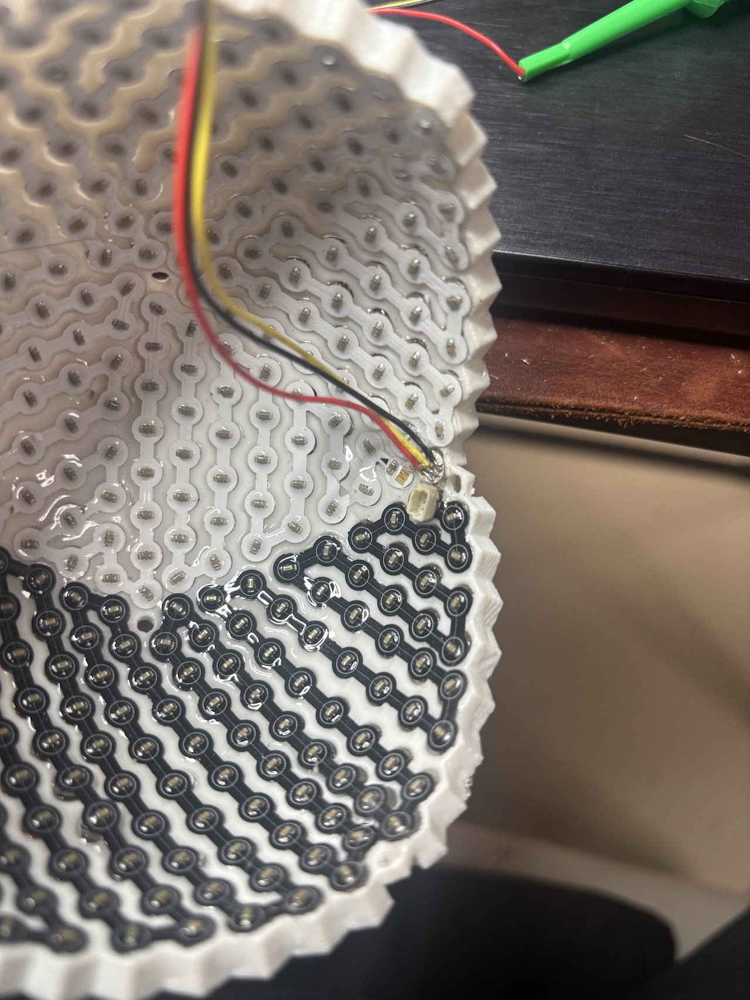

# FPC KiCad — 骨組み FPC アートワーク

<subproject>
- name: fpc-kicad
- parent: Isolation Sphere V2
- status: wip
- owner: sastle-com
- depends_on: [shell-cad]
</subproject>

## Scope / この doc が扱う範囲

- **共通骨組み FPC** (10 カセット共通の 1 種類 Gerber、各 80 LED) の KiCad アートワーク作成
- 一筆書きチェーン + polyhedral 展開図の生成 (`generate_fpc_chain.py`)
- LED 配置データ ([`../shared/led_positions.csv`](../shared/led_positions.csv)、shell-cad が producer) からの **自動 LED 配置スクリプト**
- 端子レイアウト (赤道 inner_deck の 6 パッド: `5V-GND-DIN-DOUT-GND-5V`)
- ガーバー出力までの一連の手順

> **2026-06-02 設計変更**: 極専用 PCB (案 S4) は**廃止**。全 800 hex を共通 FPC に集約 (80 LED/cassette、5 ストリップ)。極部は南極=磁気端子 / 北極=装飾蓋で LED 無し。

## Out of scope / 扱わない範囲

- 外殻 3D 形状 / 球体コア / pillar → [`01-shell-cad.md`](01-shell-cad.md)
- 磁気端子・LiPo・配線ルート → [`03-power-charging.md`](03-power-charging.md)
- ESP32 ファーム → 別プロジェクト管轄 (CLAUDE.md §1, §3 Q2)
- 赤道マザーリング基板 → 別 doc (`04-motherboard-kicad.md` 予定)

## Confirmed decisions / 確定事項

### アーキテクチャ: 全 hex 共通 FPC × 10 + 案 K_new (非極 pent ねじ穴)

- **共通骨組み FPC × 10 枚** (Gerber 1 種)
  - 各カセット **80 LED** (= カセットに属する全 hex。極先端 hex も truncate せず含む)
  - 形状: 円形ランド (LED, `ISLAND_R`=2.4mm) + 帯 (ブリッジ, `BRIDGE_W`=2.4mm) の骨組み (≠ ベタ三角ゴア)
  - 実装: **表 WS2812C-2020 / 裏 0603 バイパスコンデンサ**
  - **非極ペンタゴン位置に Φ2.7 ねじ通し穴 + M2.5 沈み込み座ぐり** — 案 K_new の M2.5 真鍮意匠ねじ用 (各 FPC に 1 個ずつ)
  - メリット: 球面追従性、熱抜け、テープ糊が外殻と直接シール

- **LED 総数: 800** = 共通 FPC hex 80 × 10 (全 hex)
  - LED 非搭載のペンタゴン (12 個全て): 非極 pent 10 個 (M2.5 ねじ穴) + 極 pent 2 個 (南極=磁気端子 / 北極=装飾蓋)

### 配線・データチェーン (5 ストリップ構成)

- 一筆書きの **DIN(start)・DOUT(end) は赤道中央で隣接** ([Q62](#open-questions--未確定事項))。inner_deck は **6 パッド = `5V-GND-DIN-DOUT-GND-5V`**(回文、データ隣=GND)。**左3→チェーン始端(DIN/LED01)/ 右3→終端(DOUT/LED80)**に接続 → 5V/GND を**バス両端から 2 枝給電** → IR ドロップ半減 + 容量2倍 + 接点冗長
- N/S 共通 FPC の上下反転は **赤道マザーリング側のクロスルーティング (`N_DOUT → S_DIN`) で吸収** ([Q62b])
- **5 並列ストリップ構成**:
  - Strip 1-5: 各 longitude slice (北 80 LED → 赤道マザーリングでクロス → 南 80 LED = **160 LED each**)
  - 南カセットの DOUT は終端 (ESP32 へ戻さない)
  - 合計: 5 × 160 = **800 LED**。極ストリップは無し
- ESP32 側: **5 並列 PIO/RMT 出力** で各ストリップを独立駆動 (fault isolation 効果)
- ポゴピン: 2.54 ピッチ **DIP (RTLECS, 1.5A/pin, ストローク 2.0mm, 75gf, 高 7mm)** を inner_deck の **FR4 補強材**で支持。**6 ピン**(電源 2 重化、スロット 12.7mm)。全 60 ポゴ ([Q67] 確定)

### inner_deck タブ = 2 本の撓みリード(3 パッド + 矩形ヘッド) (2026-06-05 確定)

一筆書きの **自由端 (DIN=チェーン始端 / DOUT=チェーン終端) からのみ** リードを生やす。中央や中間 hex から生やすと平面パターン上で骨組みと **重なって製造不能** になるため。

- **2 本の独立した 3 パッドリード**:
  - **START リード**(DIN から, KiCad ref **J1**): `5V · GND · DIN`(= 6 パッド列の左 3)
  - **END リード**(DOUT から, KiCad ref **J2**): `DOUT · GND · 5V`(= 右 3)
  - FPC 上では別々。**組立時に剛体 inner_deck 上で隣り合って初めて 6 パッド** `5V-GND-DIN-DOUT-GND-5V`(回文)になる
- **各リードは自端点のローカルで完結** → 相手側へ伸びない → FPC は重ならない
- **形状**: 端点島から外側(赤道余白)へ **~15mm の撓み帯(`STRIP_LEN`/`STRIP_W`)** を伸ばし、**撓めて**ポゴ PCB へ接続。先端は **矩形ヘッド 8×6mm(`HEAD_*`)= 補強材(stiffener)貼付ゾーン**(角丸でなく鋭角、ポゴ圧+半田の剛性確保)、その中に 3 パッド @2.54。
- **端点 = 赤道接触 hex(両端)**: 分割を殻に合わせた後、cassette 0 で **DIN=fi409 / DOUT=fi418**(両方 z≈2.6 で赤道接触・隣接)を自動選択。
- **pad 順は自由設計** → 仕様の回文 `5V-GND-DIN-DOUT-GND-5V`(データ隣=GND シールド・両端 2 枝給電)に確定
- **配置基準**: KiCad で J1/J2(3 ピンヘッダ)を **pin2(中央=GND)を原点**に配置(`place_fpc.py`)。

#### スクリプト機能 (`generate_fpc_chain.py` / `place_fpc.py`, 2026-06-05)

- `generate_fpc_chain.py`: `--din/--dout`(端点強制)、`compute_fingers()`(2 リードの strip + 矩形ヘッド + 3 パッド生成)、出力 **`output/fpc_tab_c<N>.json`**(`connector` J1/J2 込み、KiCad frame)
- `place_fpc.py`: CSV から C/D 配置 + J1/J2 を **pin2 基準**で配置 + Edge.Cuts(リード込み)。**`EDGE_ONLY=True`** で C/D/J を動かさず Edge.Cuts だけ再描画可。
- 実行(確定 cand2 legend で再現): `uv run python shell-cad/scripts/generate_fpc_chain.py -c 0 --legend shared/fpc_legend_c0.csv`
  - 確定一筆書きは **`shared/fpc_legend_c0.csv`**(列 `order,face_idx`、cand2、追跡対象)。`--legend` 無しだと端点自動+ソルバで都度別経路になるので、確定版はこの legend を渡す。

### 平面化 = 多角形(polyhedral)展開(2026-06-19、MDS を撤回し復帰)

- **MDS は実物試作で破綻**(2026-06-19)。古典 MDS は距離(stress)でなく歪み(strain)を最小化し、挙動が**正射影(影)= 系統的に短縮(foreshorten)**する。実測で **bridge の 56/79 本が geodesic 不足・最悪 1.5mm・チェーン全長 −5.2%** → FPC が穴に届かず物理的に配置不能だった。報告していた「平均 0.48mm / 穴ズレ 0.41mm」は**全ペア平均/影との比較**で、肝心の bridge 不足を隠した誤指標。
- **採用: 多角形展開(`path_unfold`)** — カセット内面は近平面 hex 面の多面体なので、各面を共有辺でヒンジして平面化すると **bridge(チェーン隣接)長を厳密保存**(実測 0/79 不足)→ FPC は必ず穴へ届く。前の樹脂埋め板でも実績あり。
- **非可展の代償 = カール**: 半ゴア(球の 1/10、Gauss 曲率 ≈ 54°)は平面に厳密展開できず、曲率は**非隣接島のドリフト(カール)**として現れる。これは**自己重なりが無ければ無害**なので、**重なりゼロの一筆書きを探索して選ぶ**(下記)。
- **一筆書き探索(2026-06-19)**: DIN/DOUT 固定・80 hex 固定で多角形展開し、自己重なり最小の路を探索。**868 本が重なりゼロ**。その中から**最も直線的**(折れ角/LED が小、急カーブ少)な **cand2** を採用(`output/fpc_cand2_c0.csv`)。最小島間隔 **5.28mm**(島直径 4.8mm 超 = 重なり無し)。
- **外側視点へ剛体整列**(回転 + 鏡像、Procrustes)で手系を正す(LED 外向き, det=+1)。展開は剛体なので bridge 長は保存。
- **⚠ カセット分割は殻(`blender_make_cassettes.py`)と完全一致が必須**。`AZ_SHIFT_DEG=54°` を共有(以前 `+36°` でズレ、16/80 hex が別面 → トレース不能だった)。`cassette_of`/`lon_centre_of` を殻に合わせ済。
- **ソルバ**: 連結性プルーニング追加で、制約の強いカセットでも赤道↔赤道の一筆書きを高速発見。端点自動選択は「両端とも赤道接触」優先(各リードが赤道エッジで折れる)。
- **tab**: 短い折りでなく **~15mm の撓みリード ×2**(START=`5V·GND·DIN` / END=`DOUT·GND·5V`)を自由端から伸ばし、撓めてポゴへ接続。

### カセットの合同性 (2026-06-04 検証)

- **北半球 5 枚 (cas 0..4)**: 純粋な **Z 軸 72° 回転で完全合同**(検証済)→ 1 設計でそのまま回転配置 OK
- **北 ↔ 南**: **赤道軸まわり 180° の proper 回転で合同**(2026-06-05 厳密検証、det=+1・残差 0.0000mm)。鏡像ではない([Q68](#open-questions--未確定事項))。**→ 共通 Gerber 1 種 × 10 で OK**。南は同一基板を 180° 回して装着(LED は外向きのまま)、DIN/DOUT 入替は回文 pad + マザーリングクロスで吸収

### 非極ペンタゴン位置のクランプねじ穴 (案 K_new)

- **位置**: 各共通 FPC に 1 箇所、緯度 ±26.57° の非極 pent 中央
- **穴形状**: Φ2.7 貫通穴 (M2.5 ねじ通し用) + 上面に Φ4.7 × 深さ 1 mm の沈み込み座ぐり (M2.5 真鍮意匠ねじ頭収容)
- **FPC 上の銅配線禁止領域**: 穴周囲 Φ4 mm を keep-out (ねじ頭との短絡防止)
- 共通 FPC が **同じ Gerber × 10** であるため、北 5 + 南 5 の全カセットに同じねじ穴が刻まれる

### LED 配置データの利用

- producer: shell-cad (`shared/led_positions.csv`)
- consumer: KiCad 配置スクリプト (V1 の `place_from_csv.py` 思想を流用)
- 必要列: `cassette_id` (0..9), `serial_index`, `x, y, z`, `normal_*`, `face_kind` (pent/hex), **`is_screw_hole` (非極 pent のみ true)**
  - 全 LED が共通 FPC 上なので `board_kind` 列は不要 (極専用 PCB 廃止)

### 参考画像 / Reference images

**V1 試作の骨組み FPC 実物** (hex island + bridge、表 WS2812C / 裏 0603、一筆書きチェーン):



> **ゴール**: この骨組み FPC をカセット裏面に貼ったとき、**FPC 上の LED 位置がカセットの hex ラッパ穴と一致**するように平面化する(多角形展開で bridge 長を厳密保存 → 穴へ確実に届く、[Q63](#open-questions--未確定事項))。

### チェーン + 平面化スクリプト `generate_fpc_chain.py` (2026-06-19 現行、多角形展開)

**スクリプト**: `shell-cad/scripts/generate_fpc_chain.py`(numpy + matplotlib + shapely、bpy 非依存)
**用途**: 1 ハーフゴアカセット分の一筆書き + **多角形(polyhedral)展開** + 骨組み FPC 外形 + ポゴリードを生成。

> ⚠️ 履歴: 2026-06-02 多角形展開(歪みゼロと誤認)→ 2026-06-05 **MDS** に置換 → 2026-06-19 **多角形展開へ復帰**。MDS は bridge を ~5% 短縮し実物が穴に届かず破綻(56/79 本不足)。多角形展開は bridge 長を厳密保存し、非可展のカールは重なりゼロの一筆書き選択で回避([§平面化 = 多角形(polyhedral)展開](#平面化--多角形polyhedral展開2026-06-19mds-を撤回し復帰) / [Q63](#open-questions--未確定事項))。

#### アルゴリズム(現行)

- **一筆書き**: Warnsdorff 順 + バックトラック DFS + **連結性プルーニング**(未訪問が連結かつ end 到達可を毎手チェック)→ 制約の強いカセットでも高速発見
  - 既定端点: **DIN/DOUT は両方とも赤道接触 hex**([`pick_endpoints`])。各リードが赤道エッジで折れる。`--din/--dout` で強制可
- **平面化 = 多角形(polyhedral)展開**: 各 hex 面を共有辺でヒンジ展開(`path_unfold`)→ bridge 長を厳密保存(0/79 不足)→ **外側視点へ剛体整列**(向き・手系を正す, det=+1)。非可展のカールは重なりゼロの一筆書き(cand2)で回避、最小島間隔 5.28mm
- **ポゴリード**: 両端から ~15mm の撓み帯 + 先端に**矩形ヘッド(補強材ゾーン)**+ 3 パッド(START `5V·GND·DIN` / END `DOUT·GND·5V`)
- **骨組み外形**: 各 island に円(`ISLAND_R`=2.4mm)+ チェーン帯(`BRIDGE_W`=2.4mm)+ リードを 1 シルエットに union

#### 2 段ワークフロー(自動素案 → legend 手修正)

```bash
# ① 素案生成(両端赤道接触を自動選択)→ legend CSV
uv run python shell-cad/scripts/generate_fpc_chain.py -c 0
# ② legend を手修正後、それで再生成
uv run python shell-cad/scripts/generate_fpc_chain.py -c 0 --legend output/fpc_legend_c0.csv
```

- **全 10 カセットは 1 種の Gerber**(proper 回転で合同, [Q68](#open-questions--未確定事項))。`-c 0` のみ設計すれば足りる。
- ⚠️ **カセット分割は殻(`blender_make_cassettes.py`)と一致必須** = `AZ_SHIFT_DEG=54°`(以前 36° でズレ 16/80 hex 不一致 → 紙がトレース不能だった)。

#### 出力(`output/` トップレベル、gitignore)

- `fpc_legend_c<N>.csv` — `order, face_idx`(編集可能な一筆書き順序)
- `fpc_unfold_c<N>.csv` — `order, face_idx, cassette_id, x3d/y3d/z3d, flat_x/flat_y, kicad_x/y, is_din, is_dout`
- `fpc_unfold_c<N>.png` — 平面図(島 + 骨組み帯 + チェーン + リード + 矩形ヘッド + DIN/DOUT)
- `fpc_skeleton_c<N>_outline.svg` + `fpc_outline_c<N>.json` — 骨組み外形(リード込み、KiCad Edge.Cuts 用)
- `fpc_tab_c<N>.json` — 2 リード(strip + 矩形ヘッド + 3 パッド、`connector` J1/J2)

#### 実行結果 (cassette 0, 2026-06-19 多角形展開 + cand2)

| 項目 | 値 |
|---|---|
| hex 面数 | 80 |
| 一筆書き | **cand2**(0重なり 868本中から最直線を選択)、**DIN=fi409 / DOUT=fi418**(両赤道接触) |
| **bridge 長(配置可否を決める指標)** | **geodesic 不足 0/79 本(最悪 0.00mm)** ← 多角形展開で厳密保存。MDS は 56/79 不足・−5.2% で破綻 |
| 直線性 | 折れ角/LED ≈ 47°、急カーブ(>120°)8、直線ステップ(<30°)35 |
| 自己重なり | min gap **5.28mm** / median bridge 6.11mm → 重なり無し(島直径 4.8mm) |
| 骨組み | island r=2.4mm + 帯 2.4mm、リード 15mm + 矩形ヘッド 8×6mm |

## Open questions / 未確定事項

<open_questions>

**チェーン経路関連 (2026-06-02 新規。Q56→Q62 等、shell-cad の Q56-Q61 との衝突回避でリナンバー)**

- **Q62 (確定・更新): DIN/DOUT = 両方とも赤道接触 hex** (2026-06-05 更新)
  - **方針**: DIN=赤道中心 hex、DOUT=その**赤道接触隣接 hex**(両方 z≈0 に接する)→ 2 本の折り出しリードが各々の赤道エッジで素直に折れる
  - **実装**: 分割を殻に合わせた後(`AZ_SHIFT_DEG=54°`)、cassette 0 で **DIN=fi409 / DOUT=fi418**(両赤道接触・隣接)を自動選択。`--din/--dout` で強制可。旧 fi626/fi627/fi628 は分割不一致時(36°)の値で無効。
  - **含意 (Q65/Q67 で確定)**: 1 カセットが赤道側に DIN・DOUT の**データ2端子** → inner_deck は **6 パッド `5V-GND-DIN-DOUT-GND-5V`**(2 本の 3 パッドリードが組立時に合体)
- **Q63 (確定 2026-06-19): 展開法 = 多角形(polyhedral)展開**(MDS を撤回し復帰)
  - ❌ **MDS は実物試作で破綻**。古典 MDS は歪み(strain)最小化で挙動が正射影=系統的短縮 → **bridge 56/79 本が geodesic 不足・最悪 1.5mm・チェーン −5.2%**、FPC が穴に届かず配置不能。「平均 0.48mm/穴ズレ 0.41mm」は全ペア平均/影比較で bridge 不足を隠した誤指標だった。
  - ✅ **採用: 多角形展開**(`path_unfold`、各 hex 面を共有辺でヒンジ)→ **bridge 長を厳密保存(0/79 不足)**。前の樹脂埋め板でも実績あり。非可展のカール(非隣接島ドリフト)は**重なりゼロの一筆書き探索**で回避(868本中、最直線の **cand2** 採用、最小島間隔 5.28mm)。+ 外側視点へ剛体整列(det=+1)。
  - 投影(equirect/sinusoidal)・MDS は不採用(bridge 長を保存できない)。詳細は本文 [§平面化 = 多角形(polyhedral)展開](#平面化--多角形polyhedral展開2026-06-19mds-を撤回し復帰)。
- **Q64: チェーンパターンの規則性** — Warnsdorff vs 列スネーク
  - **Warnsdorff** (現状): 全ブリッジ面隣接 (距離 ≈ 5.3–6.5 mm)、経路は不規則
  - **列スネーク**: 経度列ごとにジグザグ。視覚上整然だが一部ブリッジが面非隣接の可能性
  - 端点を「中央スタート+隣接エンド」に固定する Q62 と整合する経路生成が必要
- **Q65 (確定): inner_deck パッド数 = 6** — DIN/DOUT 両方赤道 + 電源 2 重化
  - **6 パッド = `5V-GND-DIN-DOUT-GND-5V`**(回文、データ隣=GND)。左3→始端/右3→終端で **5V/GND 両端 2 枝給電** → IR 半減・容量2倍・冗長 (2026-06-04 確定)
  - [shell-cad Q56](01-shell-cad.md) / CLAUDE.md §2.6 / §2.7 と同期済
- **Q66 (進行中): KiCad 配置ワークフロー = CSV スクリプト配置** (フェーズ2, 2026-06-04)
  - `place_fpc.py` が `fpc_unfold_c<N>.csv`(LED 配置)+ `fpc_outline_c<N>.json`(Edge.Cuts)+ **`fpc_tab_c<N>.json`(2 本指 + 6 パッド)** を消費
  - 端点・分割変更で **D1..D80 を全再配置**(`place_fpc.py`)。**J1/J2(3 ピン ×2)を pin2 基準**で配置済。残: DIN/DOUT/電源の配線 → DRC。`EDGE_ONLY` で外形だけ再描画可

- **Q68 (確定 2026-06-05、訂正): 北↔南は proper 回転で合同 → FPC は 1 種で OK**
  - **厳密検証**(重心保存 O(3) 写像を網羅): cas0(北)→cas5(南) は **赤道面内の軸(方位 −18°=カセット中心)まわり 180° 回転、det=+1・残差 0.0000mm・全単射 80/80**。cas0→cas1..9 すべて proper(残差 ≤0.11mm)。**鏡像ではない。**
  - 平面展開レイアウト(多角形展開)も c0↔c5 が **2D proper 合同(det=+1, 残差 0.00mm)= 同一設計を 180° 回したもの**。
  - 一見「鏡像」に見えたのは、涙滴形ゴアを 180° 回すとリードが逆向きになるため。**反射ではなく回転**。
  - ⚠️ 旧判定「鏡像 (det=−1)」は frame ベース検証(五角形+重心を対応点に固定)のバグ。対応を仮定しない網羅検証で訂正。
  - **採用: 共通 Gerber 1 種 × 10**。北 5=Z 軸 72° 回転、南 5=赤道軸 180° 回転 + 72°。LED は proper 回転で常に外向き。180° 回転時の DIN/DOUT 入替は端子回文 + マザーリング `N_DOUT→S_DIN` クロスが吸収(= 元設計の狙い通り)。

- **Q62b: マザーリングの N/S クロス + ゾーン数** — `N_DOUT → S_DIN` のクロスはリング内配線で吸収(② 確定)。ポゴゾーンは 5 経度 × (上面=北/下面=南)。ユーザー提示図は 4 回対称だったので 5 ゾーンへ要修正
- **Q67 (確定): inner_deck = 小型 FR4 PCB + 6 ピン DIP ポゴ + FPC 1 結合 tab** (2026-06-04)
  - **方式 A 採用(inner_deck を小型 PCB 化)**: 上面=FPC 半田パッド6、下面=DIP ポゴ6(−Z→ ring)。挿抜力を rigid PCB が受け **FPC に応力が来ない**(ホットスワップ堅実)。方式 B(FPC+補強材直付け)は不採用、上位案 C(rigid-flex)は将来
  - **FPC は 1 結合 tab(6 パッド)** を rim から ~90° 曲げて inner_deck 上面へ半田(flex-to-rigid)
  - **6 ピン `5V-GND-DIN-DOUT-GND-5V`**: 左3→始端(DIN/LED01)/右3→終端(DOUT/LED80)。**5V/GND 両端 2 枝給電** → IR半減・容量2倍・冗長。データ隣=GND シールド
  - inner_deck は **水平シェルフ(底面 Z=0)**(§2.6)、外形 ~16×8mm、固定=ダボ×2 + Φ2.2 ネジ(hex 交点)
  - DIP ポゴ RTLECS 1.5A/pin・ストローク2.0mm・75gf・高7mm。**全白禁止+輝度上限**運用
  - 残: 圧着力 6×75gf×10=4.5kgf は [Q54](01-shell-cad.md) のテコ検証と併せて確認

**既存 open questions**

- **Q3: ポゴピンピッチ** — 2.54mm 候補確定的(RTLECS DIP)。定格電流/ストロークは [Q67] 参照

**クローズ済み (極専用 PCB 廃止に伴い無効化分を含む)**
- ~~Q22 共通 FPC 極先端形状~~ → **極専用 PCB 廃止**。極先端 hex も truncate せず共通 FPC に含む (80 LED/cassette)
- ~~Q25 極 PCB の LED 配置~~ → **極専用 PCB 廃止により無効**
- ~~Q23~~ → 小型ポゴピン圧着確定(極側は廃止、赤道のみ)
- ~~Q24~~ → 同 Gerber + 別 populate 確定(極 PCB 廃止により無効)
- ~~Q26~~ → 南極=磁気端子/北極=装飾蓋 (LED 無し、案 K_new)
- ~~Q30~~ → **5 ストリップ (各 160 = 80×2) 確定**(極ストリップ廃止)

</open_questions>

## References

- [`../CLAUDE.md`](../CLAUDE.md) — プロジェクト共通の前提
- [`10pieces-isolation-sphere-concept.md`](10pieces-isolation-sphere-concept.md) — 一次資料
- [`01-shell-cad.md`](01-shell-cad.md) — 上流: LED 座標 producer (`shared/led_positions.csv`)

### 旧版資料 (V1 試作) / Legacy reference

- **一次置き場 (iCloud)**: `/Users/katano/Library/Mobile Documents/com~apple~CloudDocs/work/isolation-sphere/`
  - 過去の FPC 設計試作 (`kiban/` 配下: `FPC-head-all`, `FPC-side-all`, `penta-WS2812`, `pentagon-remesh-*`, `Power_BQ24616*`, 他)
  - トップレベル: `flatten.py` (球面 → 平面展開), `generate_face_connection.py` (面接続生成), 関連 CSV (`head-*.csv`, `side-all.csv`, `tri_*.csv`, `pentagons.csv` 等)
- **バックアップ**: Python スクリプトのみ [`../fpc-kicad/legacy/`](../fpc-kicad/legacy/) にディレクトリ構造を保持してコピー済 (`*.py` だけ)。CSV / Gerber / 3D モデルは iCloud 側を都度参照。
- ⚠️ V2 では Goldberg T=81 単一形状なので、V1 の `FPC-head` (北極星形) と `FPC-side` (側面六角) を分けていた設計は採用しない。配置スクリプトの考え方 (`place_from_csv.py`, `kicad_tools.py`) は流用候補。
